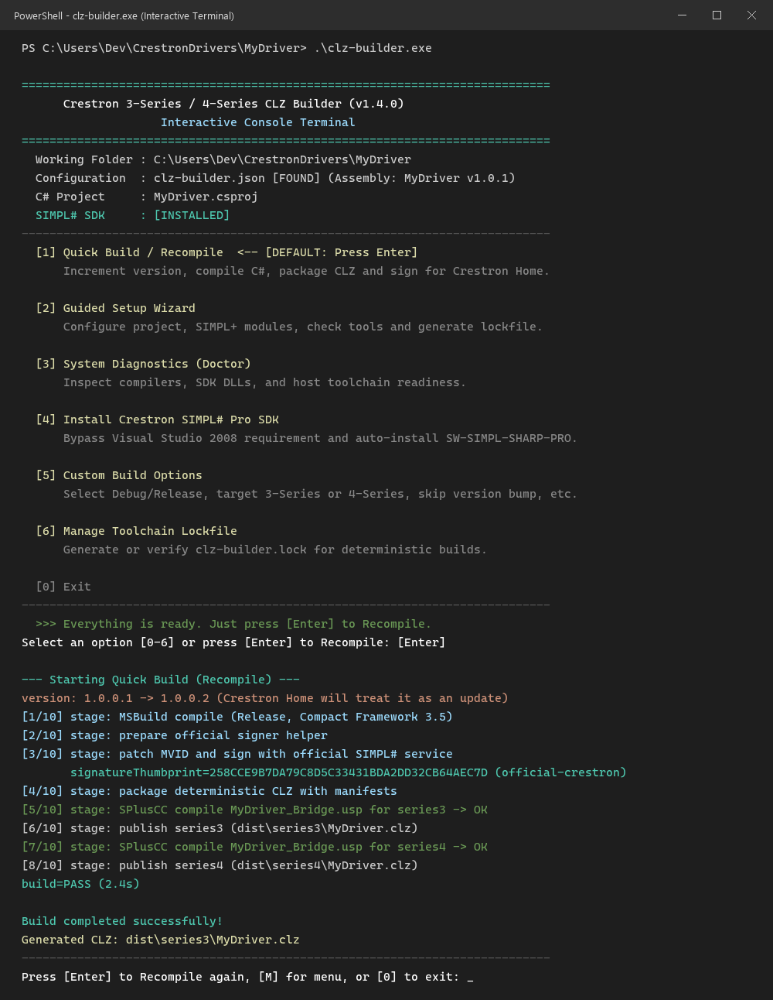

# Crestron3SeriesCLZBuilder

Open-source tooling for building Crestron `CLZ` packages.
**Drop a driver folder, run one command, get a signed `CLZ` that runs on both
3-Series and 4-Series processors, and that Crestron Home accepts as an
update.**

| | |
| --- | --- |
| **Just want the exe?** | Grab [`clz-builder.exe`](../../releases/latest) from Releases - copy it next to your driver and run it. No Python needed. |
| **Never used it?** | Follow [`docs/FOR-DUMMIES.md`](docs/FOR-DUMMIES.md) - clone-to-import walkthrough, zero knowledge assumed |
| **In a hurry?** | [Quick start](#quick-start) below - 2 commands per build |

> **Why this tool:** every build **automatically increments the driver
> version**, so when you upload the package to a processor running Crestron
> Home it is always treated as an update and reloaded - no manual version
> editing, no ignored uploads because the version did not change.

<p align="center">
  
</p>

## The Easiest Way: Standalone Interactive Terminal (No Python)

Every tagged release ships a ready-to-run Windows executable built by CI:

1. Download [`clz-builder.exe`](../../releases/latest) (plus its `.sha256`) from Releases.
2. Copy it into your driver's folder.
3. **Double-click `clz-builder.exe`** (or run `.\clz-builder.exe` in terminal).

That's it! An interactive English-language console menu opens:
- **Need SIMPL# Pro SDK?** Drop `crestron_simpl_sharp_pro_*.exe` next to `clz-builder.exe` and select **[4]** to auto-install it without requiring Visual Studio 2008.
- **First time setup?** Select **[2] Guided Setup Wizard** to configure your `.csproj` and `.usp` modules.
- **Ready to build?** When configured, the console says:
  ```text
  >>> Everything is ready. Just press [Enter] to Recompile.
  ```
- **Fast Developer Loop:** Simply press **[Enter]** to build, sign, and package. Make changes in your code editor, switch back to the console, and press **[Enter]** again to recompile immediately!

*Prefer CLI / CI/CD scripts?* All commands (`clz-builder run`, `build`, `setup`, `doctor`, `install-prereqs`) remain 100% available via standard command-line flags.

## How it works

A configuration file selects the `csproj`, assembly name, `.usp` modules,
targets (`series3`, `series4`), output directory, and reproducibility options,
so the same builder serves any project. See
[`docs/CONFIGURATION.md`](docs/CONFIGURATION.md) for the exact schema.

```text
selected config + SIMPL# source (.NET Compact Framework 3.5)
        + SIMPL+ modules + local Crestron toolchain
        ↓
MSBuild → SIMPL# assembly → official verification/signing
        ↓
deterministic CLZ + manifest + dependencies
        ↓
Crestron's SPlusCC SIMPL+ compiler per target → 3-Series / 4-Series .USH symbols
        ↓
selected output directory
```

The assembly and `CLZ` are built once and copied to selected targets. `.USH`
files are generated separately because Crestron's SIMPL+ compiler
(`SPlusCC.exe`) receives the target.
A successful build is not hardware acceptance. SIMPL Windows import, firmware,
Toolbox, reboot, and real operation still need to be checked on a processor.

## Requirements

| Component | Required for | Installation |
| --- | --- | --- |
| Windows 10/11 x64 | build and Crestron tools | supported development host |
| Git | clone and review changes | public; can be installed with winget |
| Python 3.10+ | reproducible pipeline | public; `Setup.ps1 -InstallOpenSource` can install it |
| Visual Studio 2022 / MSBuild 17.x | compile the project | [Visual Studio Community](https://visualstudio.microsoft.com/vs/community/) or [older Visual Studio downloads](https://visualstudio.microsoft.com/vs/older-downloads/) |
| .NET Framework 3.5 | public Windows feature/reference prerequisite | [Microsoft download](https://www.microsoft.com/es-es/download/details.aspx?id=21); this is not Compact Framework |
| .NET Compact Framework 3.5 | CF references and `csc.exe` | legacy/manual installation; not downloaded here |
| SIMPL Windows + SPlusCC (Crestron's SIMPL+ compiler) | generate `.USH` | local Crestron installation |
| Cresdb / Required References | data, interfaces, dependencies | local Crestron installation |
| SIMPL# SDK / SIMPLSharpService | compile/verify assembly | local Crestron installation |

Standard paths are autodetected. For a non-standard installation, keep approved
absolute paths in the local `toolchain.paths` configuration and let `doctor`
refresh `.clz-builder/toolchain.local.json`; see
[`docs/INSTALLATION.md`](docs/INSTALLATION.md).

## Selectable configuration

The core defines the configuration file schema. The stable contract must be
able to represent at least:

```json
{
  "schema": 1,
  "assembly": {
    "project": "Project/Driver.csproj",
    "name": "Driver",
    "version": "1.0.0.0",
    "minimumFirmware": "1.007.0017"
  },
  "modules": ["SIMPL/Bridge.usp"],
  "targets": ["series3", "series4"],
  "package": { "dependencies": [], "resources": [], "metadata": {} },
  "toolchain": { "paths": {} },
  "output": { "build": "build", "dist": "dist" }
}
```

Relative paths resolve from the directory containing the configuration file.
The versioned lock is always `toolchain.lock.json`; discovered absolute paths
are always kept separately in ignored `.clz-builder/toolchain.local.json`.
Configuration must not
contain secrets, certificates, or paths that require copying SDK binaries.
For a one-off run, `Build.ps1` can override `-Configuration`, `-Targets`,
`-VerifyReproducible`, `-NoPublish`, and `-RecoverLock`. Project/module
selection is recorded by `init` in the configuration file.

## Documentation

- [First-time guide](docs/FOR-DUMMIES.md): zero-knowledge, step-by-step from clone to import in SIMPL Windows.
- [Installation and dependencies](docs/INSTALLATION.md): Windows,
  VS2022/MSBuild, CF 3.5, SIMPL Windows, SPlusCC (Crestron's SIMPL+ compiler),
  Cresdb, and SIMPL# SDK.
- [Build and packaging](docs/BUILD.md): `--config` selection, pipeline,
  options, outputs, and gates.
- [Driver development](docs/DRIVER-DEVELOPMENT.md): how to write a
  3-Series-compatible SIMPL# driver in VS2022, choose CF references, define the
  SIMPL+ boundary, and test on hardware.
- [Configuration reference](docs/CONFIGURATION.md): exact schema, path rules,
  assembly output templates, local discovery, and multi-project selection.
- [Reproducibility](docs/REPRODUCIBILITY.md): lockfile, hashes, staging, and
  deliberate toolchain updates.
- [Security and signing](docs/SECURITY.md): boundaries, secrets,
  certificates, and proprietary binary handling.
- [Troubleshooting](docs/TROUBLESHOOTING.md): common failures and evidence
  needed to escalate.
- [CI](docs/CI.md): what GitHub Actions can validate and what requires a host
  with Crestron installed.
- [Prior art and acknowledgements](docs/ACKNOWLEDGEMENTS.md): community
  research that informed the project.

## License and boundaries

Original code and documentation in this repository are released under MIT.
That license grants no rights to Crestron software, trademarks, SDK, firmware,
formats, or certificates. See [`LICENSE`](LICENSE) and
[`SECURITY.md`](SECURITY.md).

Contributions must preserve the separation between open-source code and the
proprietary toolchain. See [`CONTRIBUTING.md`](CONTRIBUTING.md).
